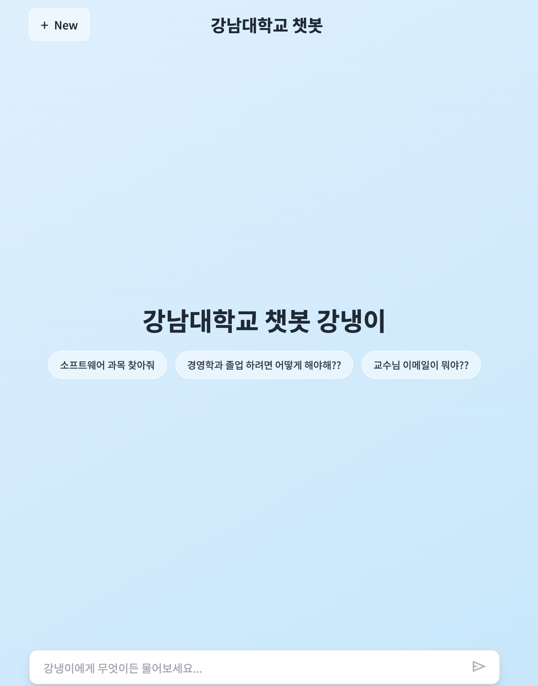

# 🤖 강남대학교 AI 챗봇 "강냉봇"

> **Google ADK 기반 Multi-Agent 시스템** - 졸업요건, 과목정보, 교수정보, 캠퍼스 안내를 한 번에!

[](https://kangnam-unv-chatbot.vercel.app)
[](https://cloud.google.com/vertex-ai)
[](https://ai.google.dev/gemini-api)

## 🎬 실행 화면

[](https://kangnam-unv-chatbot.vercel.app)

**👉 지금 바로 사용해보세요**: [https://kangnam-unv-chatbot.vercel.app](https://kangnam-unv-chatbot.vercel.app)

---

## 📋 프로젝트 개요

강남대학교 학생들이 **학교생활 관련 모든 궁금증을 24시간 빠르게 해결**할 수 있는 AI 챗봇입니다.

### ✨ 주요 기능

| 기능 | 설명 | 에이전트 |
|------|------|----------|
| 🎓 **졸업요건 검색** | 입학년도/학과별 졸업학점, 교양이수표, 필수과목 | Graduation Agent |
| 📚 **과목정보 검색** | 강의시간, 담당교수, 강의계획서, 평가방법 | Subject Agent |
| 👨‍🏫 **교수정보 검색** | 연구실 위치, 연락처, 이메일, 연구분야 | Professor Agent |
| 🏢 **캠퍼스 안내** | 건물 위치, 시설 정보, 행정부서 연락처 | Basic Info Agent |
| 📝 **입학정보** | 전형, 모집요강, 지원방법 (준비 중) | Admission Agent |

### 🎯 핵심 특징

- ✅ **통합 AI 페르소나**: 5개의 전문 에이전트가 협력하되, 사용자에게는 하나의 통합된 "강냉봇"으로 보임
- ✅ **자연스러운 대화**: 이전 대화 맥락을 기억하고, 에이전트 간 자동 전환
- ✅ **실시간 정보**: Vertex AI Search + 강의계획서 크롤링으로 최신 정보 제공
- ✅ **안전 장치**: 프롬프트 인젝션 및 유해 콘텐츠 차단 콜백 시스템
- ✅ **서버리스**: Vertex AI Agent Engine으로 배포, Idle 시 무료

---

## 🏗️ 시스템 아키텍처

```
┌─────────────────────────────────────────────────────────┐
│                    사용자 (학생)                          │
└─────────────────────────────────────────────────────────┘
                         ↓
┌─────────────────────────────────────────────────────────┐
│  Frontend (Vercel)                                      │
│  - React + Tailwind CSS                                 │
│  - Server-Sent Events (실시간 스트리밍)                  │
└─────────────────────────────────────────────────────────┘
                         ↓
┌─────────────────────────────────────────────────────────┐
│  Backend API (Cloud Run)                                │
│  - FastAPI                                              │
│  - Agent Engine 통신 및 스트리밍 중계                    │
└─────────────────────────────────────────────────────────┘
                         ↓
┌─────────────────────────────────────────────────────────┐
│  Root Agent "강냉봇" (Vertex AI Agent Engine)           │
│  - Gemini 2.0 Flash                                     │
│  - Auto-Delegation (자동 에이전트 선택)                 │
│                                                         │
│  ├─ 🎓 Graduation Agent → Vertex AI Search            │
│  ├─ 📚 Subject Agent → 강의계획서 크롤링 API           │
│  ├─ 👨‍🏫 Professor Agent → Vertex AI Search            │
│  ├─ 🏢 Basic Info Agent → Vertex AI Search             │
│  └─ 📝 Admission Agent (Placeholder)                   │
└─────────────────────────────────────────────────────────┘
```

---

## 🔧 기술 스택

### Agent Engine (goole_adk/)

| 컴포넌트 | 기술 |
|---------|------|
| **프레임워크** | [Google ADK (Agent Development Kit)](https://github.com/google/adk-docs) |
| **LLM** | Gemini 2.0 Flash |
| **배포** | Vertex AI Agent Engine (서버리스) |
| **검색** | Vertex AI Search (Discovery Engine) |
| **크롤링** | BeautifulSoup4 + Requests |

### Backend API (agent-backend/)

| 컴포넌트 | 기술 |
|---------|------|
| **프레임워크** | FastAPI |
| **배포** | Cloud Run (GCP) |
| **스트리밍** | Server-Sent Events (SSE) |
| **인증** | Google Cloud Service Account |

### Frontend (agent-frontend/)

| 컴포넌트 | 기술 |
|---------|------|
| **프레임워크** | React 18 |
| **스타일링** | Tailwind CSS |
| **배포** | Vercel |
| **API 통신** | Fetch API (EventSource) |

---

## 🚀 빠른 시작

### ⚡ 한 줄 배포

```bash
cd /Users/hong-gihyeon/Desktop/cap
./deploy_all.sh
```

**선택 옵션**:
- `1`: 전체 배포 (Agent + Backend) ⭐ **처음 배포 시**
- `2`: Agent만 배포 (코드 수정 시)
- `3`: Backend만 배포 (Backend 수정 시)

> 자세한 배포 방법은 [DEPLOYMENT.md](DEPLOYMENT.md)를 참고하세요.

---

## 📂 프로젝트 구조

```
/Users/hong-gihyeon/Desktop/cap/
│
├── 📁 goole_adk/                    # ✅ Agent Engine (현재 사용)
│   ├── agent.py                    # Root Agent (강냉봇)
│   ├── callbacks.py                # 안전 콜백 (프롬프트 인젝션 방지)
│   ├── agents/                     # Sub-Agents
│   │   ├── graduation/             # 졸업요건 Agent
│   │   ├── subject/                # 과목정보 Agent
│   │   ├── professor/              # 교수정보 Agent
│   │   ├── basic_info/             # 캠퍼스 안내 Agent
│   │   └── admission/              # 입학정보 Agent (준비 중)
│   ├── data/                       # RAG 데이터 (JSONL)
│   └── test/                       # 테스트 코드
│
├── 📁 agent-backend/               # ✅ Backend API (현재 사용)
│   ├── main.py                     # FastAPI 엔트리포인트
│   ├── routers/
│   │   └── chat.py                 # 채팅 API
│   ├── services/
│   │   └── chat_service.py         # Agent Engine 통신
│   └── deploy_backend.sh           # 배포 스크립트
│
├── 📁 agent-frontend/              # ✅ Frontend (현재 사용)
│   ├── src/
│   │   ├── AgentChat.jsx           # 메인 채팅 컴포넌트
│   │   ├── services/
│   │   │   └── chatService.js      # Backend API 통신
│   │   └── index.css               # 전역 스타일
│   └── public/
│
├── 📁 이것저것/                     # 발표자료, 산출물
│   ├── 강냉봇 시연영상.mp4
│   ├── 최종 발표자료.pdf
│   └── 산출물들/
│
├── 📄 DEPLOYMENT.md                # ⭐ 배포 가이드 (통합)
├── 📄 README.md                    # 이 파일
├── 📄 chatbot_prd.md              # 제품 요구사항 정의서
├── 📄 API_Specification.md        # API 명세서
├── 📄 TROUBLESHOOTING.md          # 문제 해결 가이드
│
├── 🔧 deploy_all.sh               # 통합 배포 스크립트
├── 🔧 update_deployment.sh        # Agent Engine 배포 스크립트
├── 🔧 deploy.py                   # Agent Engine 배포 도구
├── 🔧 create_staging_bucket.py    # GCS 버킷 생성
│
└── 📝 requirements.txt            # Python 의존성
```

### 📌 디렉토리 설명

| 디렉토리 | 상태 | 설명 |
|---------|------|------|
| `goole_adk/` | ✅ **현재 사용** | ADK 기반 Multi-Agent 시스템 |
| `agent-backend/` | ✅ **현재 사용** | FastAPI Backend (Cloud Run) |
| `agent-frontend/` | ✅ **현재 사용** | React Frontend (Vercel) |
| `이것저것/` | ✅ **유지** | 발표자료, 산출물 보관 |
| `backend/`, `frontend/`, `src/`, `streamlit/` | 🗄️ **Deprecated** | 구버전 코드 (LangGraph 기반) |

---

## 🎮 사용 예시

### 대화 예시 1: 졸업요건 → 과목정보

```
사용자: 2024년 공과대학 졸업 요건 알려줘

강냉봇: 2024학년도 공과대학 졸업요건은 다음과 같습니다:

✅ 기초교양: 17학점
✅ 계열교양: 9학점
✅ 균형교양: 9학점
✅ 전공학점: 
   - 심화전공자: 66학점
   - 다전공자: 39학점
✅ 최소졸업학점: 130학점

더 자세한 정보가 필요하시면 말씀해주세요!

---

사용자: 전공 과목 중에 데이터베이스 있어?

강냉봇: 네, 데이터베이스 과목이 있습니다:

📚 데이터베이스 (3학점)
- 담당교수: 홍길동 교수님
- 강의시간: 월3, 수4
- 분반: 01

강의계획서가 궁금하시면 말씀해주세요!
```

### 대화 예시 2: 교수정보 → 과목정보

```
사용자: 김철주 교수님 알려줘

강냉봇: 김철주 교수님은 소프트웨어학부 교수님이시고,
연구실은 이공관 301호입니다.

📧 이메일: kim@kangnam.ac.kr
📞 전화: 031-280-xxxx
🔬 연구분야: 데이터베이스, 소프트웨어공학

---

사용자: 교수님이 하는 강의 알려줘

강냉봇: 김철주 교수님이 담당하시는 강의는 다음과 같습니다:

1. 데이터베이스 (월수 3-4교시, 3학점)
2. 소프트웨어공학 (화목 2-3교시, 3학점)

강의계획서가 궁금하시면 말씀해주세요!
```

---

## 🛠️ 개발 환경 설정

### 필수 요구사항

- **Python**: 3.10 이상
- **Node.js**: 18 이상
- **Google Cloud CLI**: 최신 버전
- **GCP 프로젝트**: `kangnam-backend`

### 1. Python 환경 설정

```bash
cd /Users/hong-gihyeon/Desktop/cap

# uv 사용 (권장)
uv pip install -r requirements.txt

# 또는 일반 pip
pip install -r requirements.txt
```

### 2. GCP 인증

```bash
# GCP 로그인
gcloud auth login

# Application Default Credentials
gcloud auth application-default login

# 프로젝트 설정
gcloud config set project kangnam-backend
```

### 3. 환경 변수 설정

`.env` 파일을 프로젝트 루트에 생성:

```bash
# Google Cloud 설정
GOOGLE_CLOUD_PROJECT=your-project-id
VERTEX_AI_LOCATION=us-east4

# GCS Bucket
GCS_BUCKET_NAME=your-bucket-name
GCS_BUCKET_LOCATION=asia-northeast3

# Vertex AI Search Corpus
KANGNAM_CORPUS_ID=your-corpus-id

# Agent Resource ID (배포 후 자동 추가됨)
AGENT_RESOURCE_ID=projects/your-project-number/locations/us-east4/reasoningEngines/your-engine-id
```

### 4. Frontend 로컬 실행

```bash
cd agent-frontend
npm install
npm start
```

브라우저에서 http://localhost:3000 접속

---

## 📚 문서

| 문서 | 설명 |
|------|------|
| **[DEPLOYMENT.md](DEPLOYMENT.md)** | ⭐ **배포 가이드** (Agent + Backend + Frontend) |
| [goole_adk/README.md](goole_adk/README.md) | Agent Engine 상세 설명 |
| [goole_adk/DEPLOYMENT.md](goole_adk/DEPLOYMENT.md) | Agent Engine 배포 상세 가이드 |
| [goole_adk/README_STRUCTURE.md](goole_adk/README_STRUCTURE.md) | Agent 프로젝트 구조 |
| [agent-backend/README.md](agent-backend/README.md) | Backend API 가이드 |
| [agent-frontend/README.md](agent-frontend/README.md) | Frontend 가이드 |
| [TROUBLESHOOTING.md](TROUBLESHOOTING.md) | 문제 해결 가이드 |

---

## 🧪 테스트

### Backend API 테스트

```bash
# Backend URL 확인
BACKEND_URL=$(gcloud run services describe agent-backend-api \
  --region=us-east4 \
  --format="value(status.url)")

# 헬스 체크
curl $BACKEND_URL/health

# 새 세션 생성
curl -X POST $BACKEND_URL/chat/new

# 메시지 전송
curl -X POST $BACKEND_URL/chat/message \
  -H 'Content-Type: application/json' \
  -d '{
    "user_id": "test",
    "session_id": "123",
    "message": "안녕하세요"
  }' \
  -N
```

### Agent Engine 테스트

```bash
# 세션 생성
python deploy.py --create_session \
  --resource_id="projects/.../reasoningEngines/..."

# 메시지 전송
python deploy.py --send \
  --resource_id="projects/.../reasoningEngines/..." \
  --session_id="..." \
  --message="2024년 공과대학 졸업 요건"
```

---

## 🔍 트러블슈팅

### 자주 발생하는 문제

| 문제 | 해결 방법 |
|------|----------|
| `AGENT_RESOURCE_ID`가 없음 | `./update_deployment.sh` 실행 |
| Backend가 이전 Agent 사용 | Backend 재배포: `cd agent-backend && ./deploy_backend.sh` |
| 403 Permission Denied | IAM 권한 설정 (DEPLOYMENT.md 참고) |
| ModuleNotFoundError | 프로젝트 루트에서 실행, 의존성 재설치 |
| Frontend Network Error | Backend URL 확인, Vercel 환경변수 확인 |

자세한 내용은 [DEPLOYMENT.md의 트러블슈팅 섹션](DEPLOYMENT.md#트러블슈팅)을 참고하세요.

---

## 📊 배포 상태

| 컴포넌트 | 상태 | URL |
|---------|------|-----|
| **Frontend** | ✅ 운영 중 | [https://kangnam-unv-chatbot.vercel.app](https://kangnam-unv-chatbot.vercel.app) |
| **Backend API** | ✅ 운영 중 | Cloud Run (GCP) |
| **Agent Engine** | ✅ 운영 중 | Vertex AI Agent Engine |

**마지막 배포**: 2025-11-16  
**배포 버전**: 2.1

---

## 👨‍💻 개발자

- **홍기현** - 1인 개발 (Agent Engine, Backend, Frontend, 배포 자동화)

---

## 📝 라이선스

이 프로젝트는 강남대학교 소프트웨어응용학부 캡스톤 프로젝트입니다.

---

## 🙏 감사의 말

- **Google Cloud Platform**: Vertex AI Agent Engine, Vertex AI Search 제공
- **Google ADK**: Multi-Agent 프레임워크 제공
- **Vercel**: Frontend 호스팅 제공

---

**문의**: 추가 질문이나 문제가 있으시면 [DEPLOYMENT.md](DEPLOYMENT.md) 또는 [TROUBLESHOOTING.md](TROUBLESHOOTING.md)를 참고하세요.
